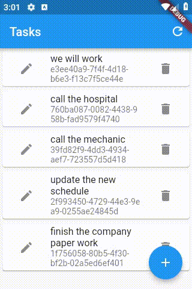

# e018_flutter_animatedlist_sizetransition_icon

## Based On e015

- [elrashid-flutter-examples/e015_flutter_animatedlist_sizetransition_e004base](https://github.com/elrashid-flutter-examples/e015_flutter_animatedlist_sizetransition_e004base)

  - Based On e014

    - [elrashid-flutter-examples/e014_flutter_animatedlist_noanimation_e004base](https://github.com/elrashid-flutter-examples/e014_flutter_animatedlist_noanimation_e004base)

      - Based On e004 :

        - [elrashid-flutter-examples/e004_flutter_listview_crud_app_using_nonsecure_rest_api](https://github.com/elrashid-flutter-examples/e004_flutter_listview_crud_app_using_nonsecure_rest_api)

## Screen Record

## What

- Icons.remove + SizeTransition + AnimatedList for tasks in flutter Task app (e004)

- must run with :

  - [elrashid-flutter-examples/e002-aspcore-rest-api-server-for-flutter](https://github.com/elrashid-flutter-examples/e002-aspcore-rest-api-server-for-flutter)

## Full code

      _myListKey.currentState.removeItem(
          ti,
          (BuildContext context, Animation<double> animation) =>
              Icon(Icons.remove),
          duration: Duration(seconds: 5));
    }

## Ref

[e015](https://github.com/elrashid-flutter-examples/e014_flutter_animatedlist_noanimation_e004base)
